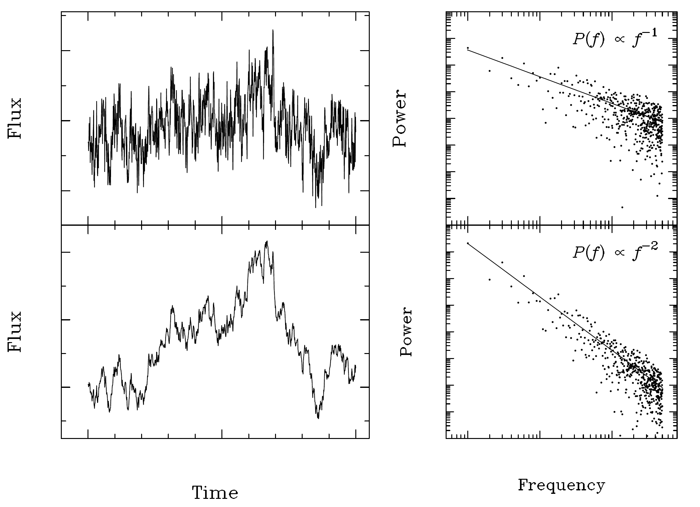
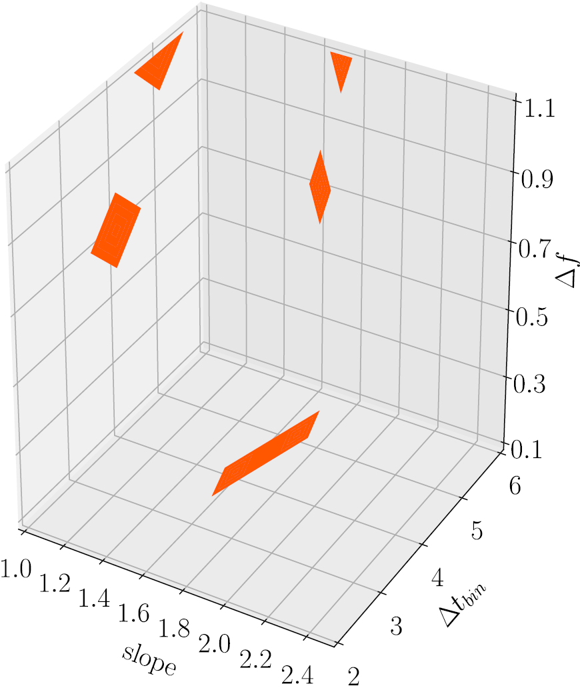
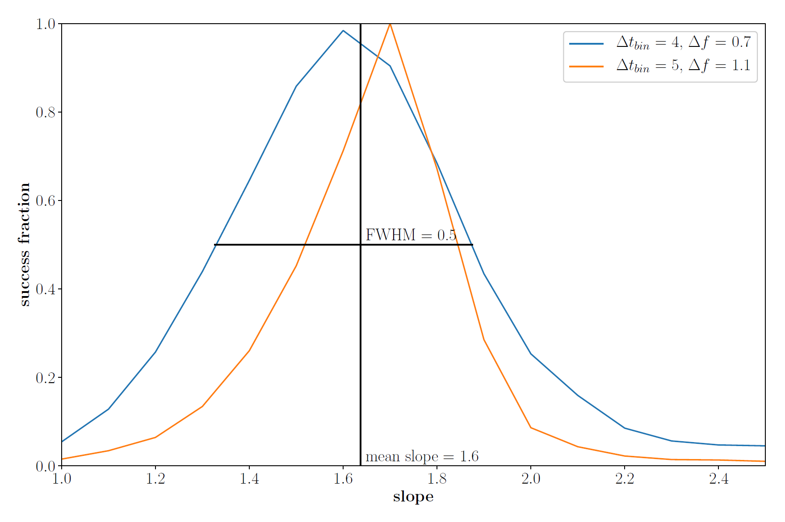
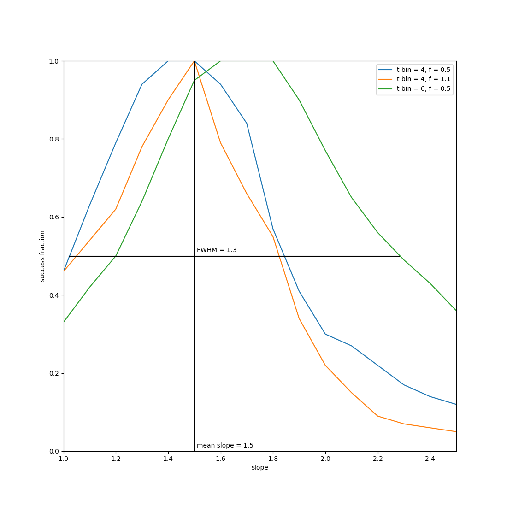

*****************************
Power spectral response method
*****************************

Introduction
============
The scripts in this repo establish the power spectral response method (PSRESP) for the analysis of the power spectral density (PSD) of light curves.
It is a Monte Carlo approach that takes the sampling directly into account and reveals the underlying PSD [1]_.
As model for the PSD, an unbroken power law is assumed.
For each model parameter (i.e. slope of the power law), a success fraction (SUF) is calculated that defines the inverse rejection level for this model.
The slope of the PSD model for the light curve is estimated as the mean of all slopes providing a significant SUF.
The corresponding error is given by the full width at half maximum (FWHM) of the SUF distribution.

The code is written in accordance with gammapy for more convenient inmplementation. Test-scripts for analysis and plot are also provided.

Background
==========
The flux variability of an AGN can be described by a power spectral density (PSD) following a pure power law noise, where PSD(f) is proportional to the frequency to the power of alpha [2]_. To reveal the PSD of a light curve, the logarithmic periodogram is calculated, where the slope denotes the underlying power:

   
   Simulated light curves (left) with an underlying power law PSD and their corresponding periodograms (right).
   The upper panel shows a flicker noise with :math:`alpha = −1`, the lower panel shows a random walk with :math:`alpha = −2`.
   Note the large scatter in the periodogram (dots) around the underlying PSD (solid line). Figure taken from [3]_.
   
However, for unevenly sampled data sets like VHE gamma-ray light curves, this simple approach of fitting a linear model to the periodogram doesnt't work anymore, since it gets aliased by gaps in the measurement.
The PSRESP takes these effects into account by applying the same sampling as the measurement on numerous simulated light curves.
The artificial light curves are generated using the algorithm by Timmer and Koenig [4]_ assuming a power-law PSD.
The periodograms of both observed and simulated light curves are compared using a chi-square-statistic.
This process is repeated over a grid of trial slopes, as well as bin factors for the light curve and periodogram, since binning is required simulation-wise and for the chi-square-statistic.
For each set of parameters, the goodness-of-fit is determined by the success fraction (SUF).

   
   Contour plot for the bin length of the light curve and bin factor of the logarithmic periodogram for each trial slope.
   The colour denotes the parameter sets providing a 95%-quantile of the success fraction distribution.

Only binning providing a certain SUF-percentile is considered for further analysis, where the SUF is depicted over the grid of slope.
The underlying slope of the PSD is assumed to be reflected as a peak in the SUF with the width of the peak as error estimate.

   
   Success fraction as a function of the PSD slope for PSRESP parameters satisfying the significance criteria.
   It reveals the correct slope of alpha = 1.6 with an FWHM of 0.5.

Oversampling of the simulated light curve and the number of simulations also affect this method, but are kept konstant during simulation.

Getting Started
===============
Input
-----
`psresp` takes a light curve in format time, flux and flux error.
For the PSD model, the trial slopes have to be forwarded via `slopes`.
The PSRESP method bins the light curve and the periodogram as defined by `dt` and `df`.
To determine the significant SUF, the percentile for the SUF distribution, `percentile`, needs to be given.
The number of simulations can be defined by `number_simulations`, it is 100 by default.
Additionally, the oversampling of the artificial light curves can be defined by `oversampling`.
`~plot_psresp` takes the output of `~gammapy.time.psresp` as input.

Output
------
`psresp` returns the mean slope and its error,
the success fraction as a function of model parameters (`slopes`, `dt`, `df`),
parameters `dt` and `df` providing a significant SUF
and the statistics used to calculate the mean slope and its error.

Test
----
Tests for analysis and plot can be carried out with the test-scripts.

Example
=======
An example for estimating the slope of the power spectral density of an AGN light curve is shown in the figure below.
The light curve is from the gamma-ray source Mrk 421 observed with MAGIC at energies above 0.3 TeV in 2009 [5]_.
The PSRESP reveals the slope of the underlying PSD model to :math:`(1.5 \pm 1.3)` days
in agreement with :math:`(1.6 \pm 0.9)` [5]_.
Please note that in [5]_, only the half width at half maximum is used as an estimate for the slope error,
resulting in a less restricting estimate.

.. [1] Uttley et al, "Measuring the broad-band power spectra of active galactic nuclei with RXTE", `Link <https://academic.oup.com/mnras/article/332/1/231/974626/Measuring-the-broad-band-power-spectra-of-active>`_
.. [2] Lawrence, A. and I. Papadakis (1993). “X-ray variability of active galactic nuclei - A universal power spectrum with luminosity-dependent amplitude”. In: The Astrophysical Journal 414.10, pp. L85–L88.
.. [3] Vaughan, S. et al. (2003). “On characterizing the variability properties of X-ray light curves from active galaxies”. In: Monthly Notices of the Royal Astronomical Society 345, pp. 1271–1284.
.. [4] Timmer and Koenig (1995), "On generating power law noise", `Link <http://adsabs.harvard.edu/abs/1995A%26A...300..707T>`_
.. [5] MAGIC collaboration, The 2009 multiwavelength campaign on Mrk 421: Variability and correlation studies,
   `Link <https://arxiv.org/pdf/1502.02650.pdf>`_
